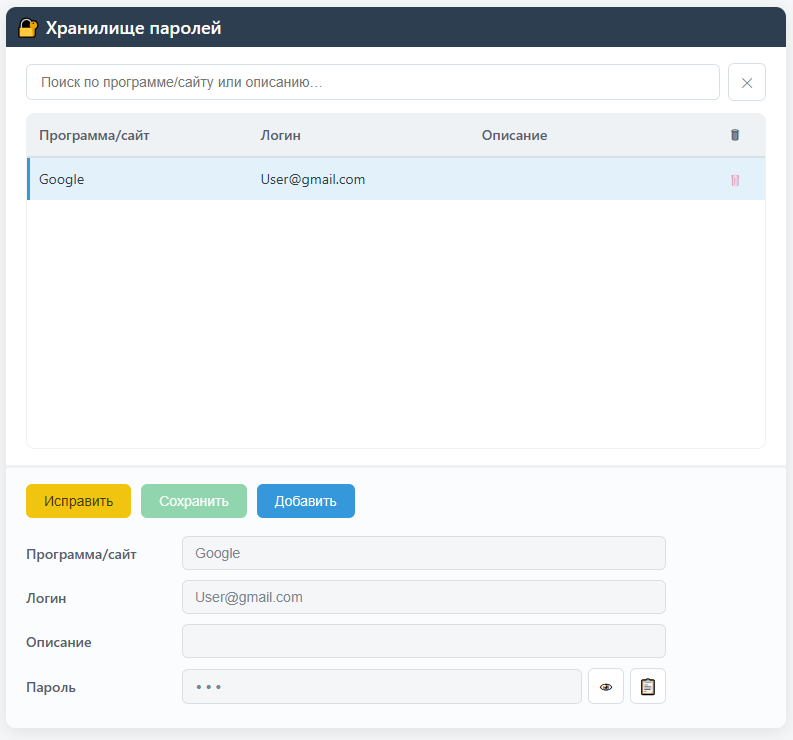

# Logovnik / Логовник

EN: A simple WebView-based password manager with master-key protection.

RU: Простой менеджер паролей на WebView с защитой паролей мастер ключом.



## Install Windows / Установка на Windows

```cmd
git clone https://github.com/Ronin1024/logovnik

go build -ldflags "-H=windowsgui" -o logovnik.exe ./main.go

logovnik.exe
```

